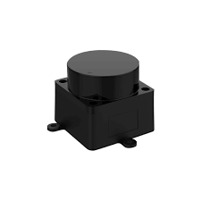

# LDROBOT-LIDAR-STL

[](https://www.arduino.cc/reference/en/libraries/)
[](https://opensource.org/licenses/MIT)


Arduino library for the LDRobot D500 LIDAR (STL-19P).



This library parses STL-19P scan packets from an Arduino `Stream`, validates the packet CRC, interpolates point angles, converts angle and distance units, and returns decoded samples through a callback. If you are doing SLAM you can use the `is_obstacle` flag to determine if the reported distance is an obstacle or obstacle-free.

### Notes

- The parser expects STL-19P frames beginning with `0x54 0x2C`.
- Each packet contains 12 sample points.
- `readData()` returns `true` only when a full valid packet has been received and decoded.
- If no callback is registered, decoded points are printed to `Serial` by default.
- The baud rate must be set to 230400 bit 1 stop bit
- This library can also be used with and w/o Arduino Emulator on the desktop: e.g Linux

### Supported Lidars

The following variants should be supported by this library:
- LD19
- STL-19P
- LD06
- D300 (kit)
- D500 (kit)

## Pinout

Pins from left to right:
1) Tx Output LiDAR signal output 3.3V 
2) PWM Input Motor control signal 3.3V  (0V-3.6V)
3) GND Power Power ground (negative) - 0V 
4) P5V Power Power positive  5V (4.5V-5.5V)

The serial output should be at 3.3V logic level.
If you do not provide an PWM Motor Control set the value to GND

## Features

- Parses STL-19P serial packets directly from any Arduino `Stream`
- Validates frames with CRC-8
- Emits one decoded result per sample

- Result supports multiple angle units:

  - `LidarAngleUnit::DEG`: 0 - 360 degree clock wise 
  - `LidarAngleUnit::RAD`: 0 - 2*PI clock wise
  - `LidarAngleUnit::DEG_ROS`: 0 forward, + left, - right
  - `LidarAngleUnit::RAD_ROS`: 0 forward, + left, - right in radian

- Result supports multiple distance units:

  - `LidarDistanceUnit::MM`
  - `LidarDistanceUnit::CM`
  - `LidarDistanceUnit::M`
  - `LidarDistanceUnit::IN`

- Optional debug output when no callback is registered
- Optional callback for reading bytes from the lidar


## Documentation

- [Examples](examples/)
- Class Documentation


## Installation

For Arduino, you can download the library as zip and call include Library -> zip library. Or you can git clone this project into the Arduino libraries folder e.g. with

```
cd  ~/Documents/Arduino/libraries
git clone https://github.com/pschatzmann/TinyRobotics.git
```

The Arduino libraries directory depends on the OS:

- Linux: `~/Arduino/libraries/`
- macOS: `~/Documents/Arduino/libraries/`
- Windows: `Documents/Arduino/libraries/`

